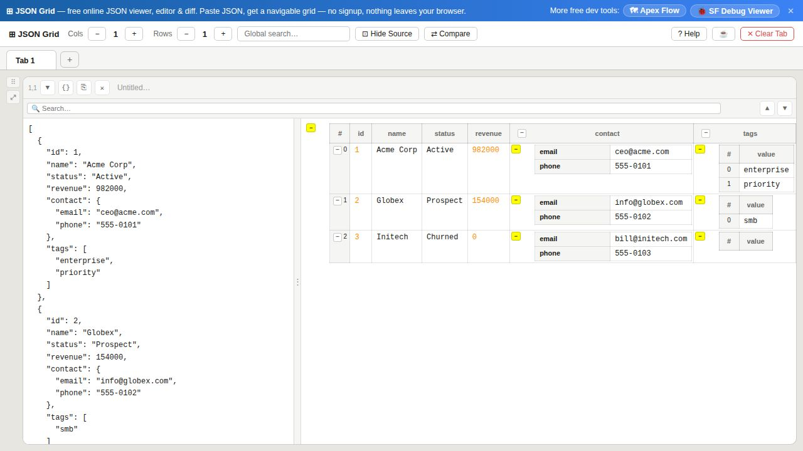
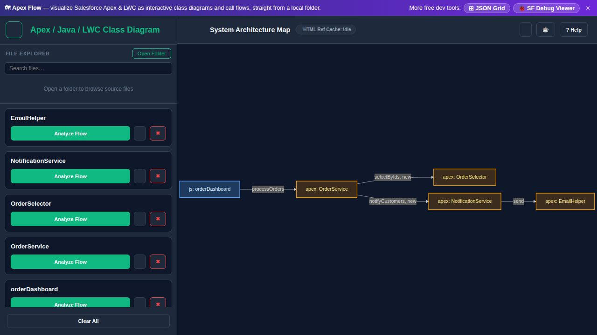
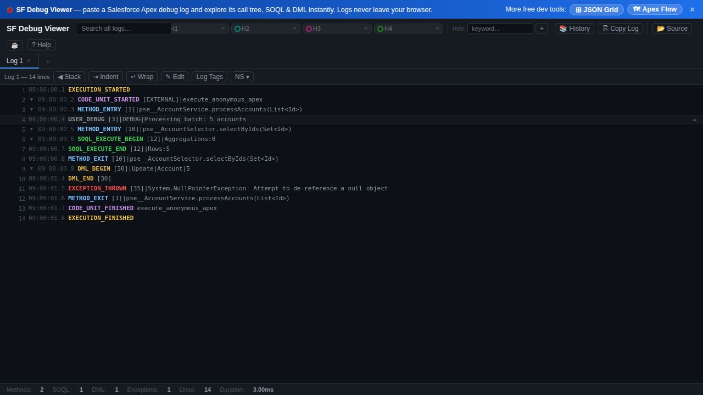

# jsonGrid — Free Browser-Based Developer Tools

Three fast, private, zero-install developer tools that run **entirely in your browser**. No signup, no upload — your data never leaves your machine. Built especially for Salesforce developers, plus a general-purpose JSON workspace.

| Tool | What it does | Open it |
|---|---|---|
| 🟦 **JSON Grid** | View, format, edit & compare JSON in a grid | **[jsongrid.trendx.uk](https://jsongrid.trendx.uk/)** |
| 🟪 **Apex Flow** | Salesforce Apex & LWC class diagrams + call-flow charts | **[apexflow.trendx.uk](https://apexflow.trendx.uk/)** |
| 🟦 **SF Debug Viewer** | Salesforce Apex debug log analyzer | **[apexdebug.trendx.uk](https://apexdebug.trendx.uk/)** |

> **Free** · runs **100% in your browser** · works **offline** · automatic **dark mode** · zero dependencies

Each tool has a **? Help** button with a built-in **Load sample** so you can see it working in one click.

---

## 🟦 JSON Grid

An interactive workspace for viewing, editing, and comparing JSON using a flexible grid layout — paste JSON, get a navigable table.



**Highlights**

- **Multi-cell grid** across configurable columns and rows, with multiple independent **tabs**
- **Rendered table view** — arrays of objects become navigable tables; nested objects/arrays expand and collapse
- **Pretty-print** with per-column and per-row expand/collapse
- **Side-by-side diff** — select any two values to compare them with color-coded changes
- **Search** — globally across all cells, or per-cell with matches highlighted in both panels
- **Salesforce Apex debug parsing** — paste Apex object print-outs or noisy log lines and convert them to JSON tables
- **Drag & drop** `.json` files, **copy** any node, and **auto-save** to local history

👉 **[Open JSON Grid](https://jsongrid.trendx.uk/)** · full details in [`README-index.md`](README-index.md)

---

## 🟪 Apex Flow

Turn Salesforce Apex, Lightning Web Components (LWC), and Java source into interactive **class diagrams** and recursive **call-flow charts** — straight from a local project folder, no server or build step.



**Highlights**

- **Open a whole project folder** (File System Access API) or drop individual `.cls` / `.java` / `.js` / `.html` files
- **Architecture map** of all classes and components, with Apex / LWC / LWC-child / HTML nodes color-coded
- **Apex + LWC + Java in one diagram**, including cross-language links (e.g. an LWC's `@salesforce/apex/...` import)
- **Analyze Flow** — drill into a class's methods and see recursive call chains up to 6 levels deep
- **Hide/Show children per edge**, collapsible nodes, and **ghost nodes** for not-yet-loaded classes
- **View source** in a syntax-highlighted modal; **pan & zoom**; **copy** the Mermaid definition
- **Background indexing** with counts, **file history**, and folder handle remembered across visits

👉 **[Open Apex Flow](https://apexflow.trendx.uk/)** · full details in [`README-apexflow.md`](README-apexflow.md)

---

## 🟦 SF Debug Viewer

Paste or drop a raw **Salesforce Apex debug log** and instantly explore it as a color-coded call tree with filtering, search, and history.



**Highlights**

- **Call tree** of methods, constructors, SOQL, DML, callouts, flows, exceptions, and variable assignments
- **Synced raw log view** — click a log line to jump to its tree node, and vice versa
- **Type filters** and **toggles** (User Debug, system methods, variable assignments, timing gaps)
- **Namespace** and **log-tag** filters; **keyword hide**; up to 4 **highlight** slots
- **Multi-tab** for several logs at once, with **global search** across them
- **Stats bar** — methods, SOQL, DML, exceptions, line count, execution duration
- **History** auto-saved locally; **drag & drop** `.log` / `.txt` files

👉 **[Open SF Debug Viewer](https://apexdebug.trendx.uk/)** · full details in [`README-sf-debug-viewer.md`](README-sf-debug-viewer.md)

---

## Why these tools?

- **Private by design** — everything runs client-side. Your JSON, your code, and your debug logs are never uploaded to any server.
- **No install, no signup** — just open a URL. They also work offline once loaded.
- **Free** — if they save you time, you can [buy me a coffee](https://buymeacoffee.com/xer900009) ☕.

---

## For developers

The tools are plain single-file HTML with inlined CSS/JS — open any file in [`public/`](public/) directly in a browser, or serve the folder:

```bash
python -m http.server 8000 --directory public
# then open http://localhost:8000/jsongrid.html
```

**Browser requirements:** Chrome, Firefox, Safari, or Edge with ES6+ and `localStorage`.

### Build & deploy

The live sites are three Cloudflare Workers sharing one codebase; a Worker (`src/index.js`) routes each subdomain to the right file and serves `robots.txt` / `sitemap.xml`.

```bash
npm install
npm run build        # public/ -> dist/ with inline JS obfuscated (npm run build:readable to skip)
./deploy.sh          # builds, then deploys all three Workers
```

The **readable source lives in `public/`** — the only place to edit. `npm run build` generates the obfuscated `dist/` that gets deployed. Project layout:

```
public/        Readable source (jsongrid.html, apexflow.html, sf-debug-viewer.html) + sample screenshots
src/index.js   Cloudflare Worker — subdomain routing, robots.txt, sitemap.xml
build.js       public/ -> dist/ obfuscation build
scripts/       Tooling (e.g. regenerate sample screenshots)
wrangler*.jsonc  One deploy config per site
```

| Subdomain | File served |
|---|---|
| `jsongrid.trendx.uk` | `jsongrid.html` |
| `apexflow.trendx.uk` | `apexflow.html` |
| `apexdebug.trendx.uk` | `sf-debug-viewer.html` |

## License

MIT
